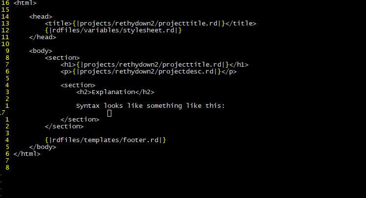
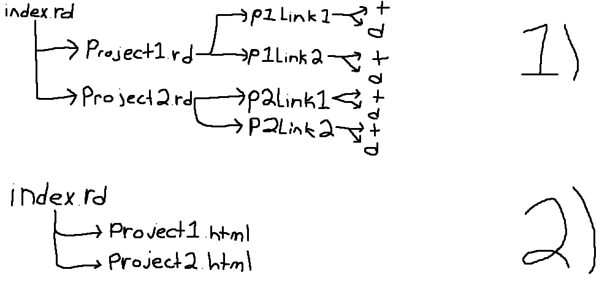

# `rethydown2`
A template-based static site generator (v2.0).

## Explanation
If you need something that handles complex, real pre-processing, consider using a proper backend language like PHP instead of a static site generator. I see people flock to SSGs without the need for one. You're only shooting yourself in the foot if you use the wrong tool for the job.

There are fancier static site generators out there. `rethydown2` isn't one of them. With `rethydown2`, you get a simple concept that works well for basic websites, but not complex ones. It scales 1:1 if you have a clear organizational structure between your files and your script. If you need something small and basic, this might be the tool for you.

## Tokens
`{|` and `|}` are symbol clusters used to signify the start and stop of a path declaration. A path declaration defines a pointer to a template file.

## Comments
Starting a line by `{||}` will comment out the entire line.

## Templates
Templates are `.html` (or `.rd` files) containing code you'd like to place on multiple pages. Templates allow you to add duplicate code to pages while reducing redundancy.

## Syntax
File syntax looks like this:

The only syntax `rethydown2` adds to a file is the two tokens as defined in the token section.

## Usage
`python3 rethydown2.py index.rd about.rd projects/example/index.rd projects/example/test.rd`

This line defines a typical `rethydown2` program call.

## Organization Methods
I use a sort of templates + variables method consistently. There are likely other ways to use this I haven't thought of. If you think of something clever I haven't included, feel free to email me your idea.

### Template + Variable Combo

Templates and variables are used per project. Variable files, such as `projecttitle.rd`, would be placed directory in a project directory, such as `projects/rethydown2/projecttitle.rd`. `projecttitle.rd` would contain something like `rethydown2`, or an alternate title. You would do the same thing for `projectdesc.rd`, etc. These templates would then be sourced using the `rethydown2` invocation tokens I mentioned above and in the screenshot. It's a simple concept, but it's effective if you want to avoid something such as PHP.

### Template Nesting
Imagine you have an `index.rd` file that is looking for two template files named `projects1.rd` and `projects2.rd`, each containing a list of &lt;a href&gt; tags of your project files. Imagine you want to have your project links look for variables for dynamic titles and descriptions. This is possible with a bit of process order hacking. Here's a diagram better explaning this methodology: 

Image depicts an `rd` program call structure *pre-* and *post-* conversion.

`index.rd` is your index page. `project1.rd` and `project2.rd` are your dynamic files that hold your dynamic project links. p1link1, p2link1, ... are the dynamic links found in the `project1.rd` and `project2.rd` script files. Each point to `title.rd` and `description.rd` files. `title.rd` and `description.rd` does not contain any dynamic processing, holding only a string each.

To ensure `index.rd` is processed last, and uses the static content, you must process each one of your project files first. The program execution order would look like this:

`python3 rethydown.py project1.rd project2.rd index.rd`

`rethydown2` will spit out `project1.html` and `project2.html` as individual html files. there will no longer be any sort of dynamic scripting held within once they're output as `.html` files.

Ensure that `index.rd` is sourcing the `project1.html` and `project2.html` files, rather than the `.rd` variants.